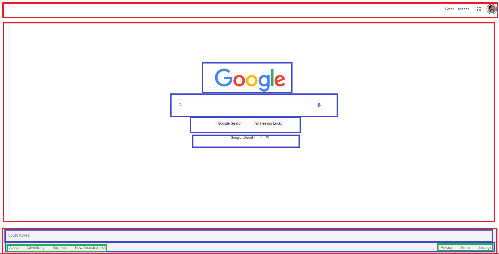
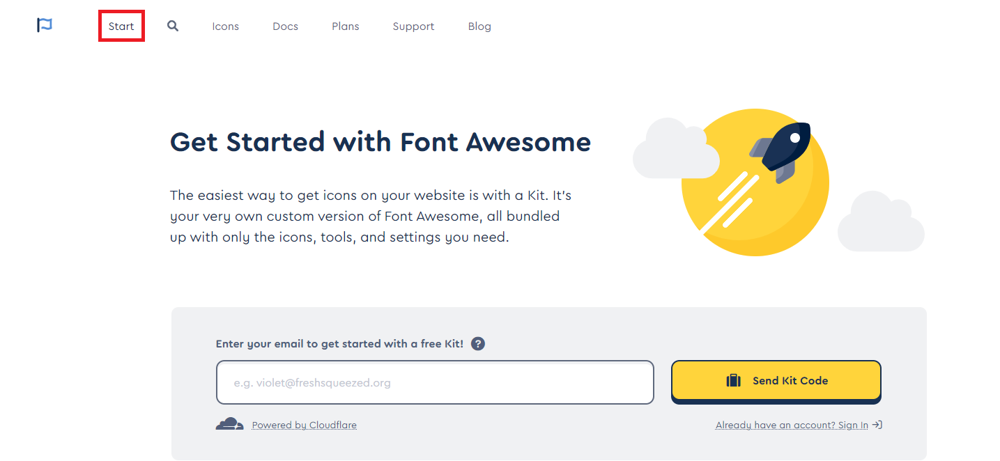
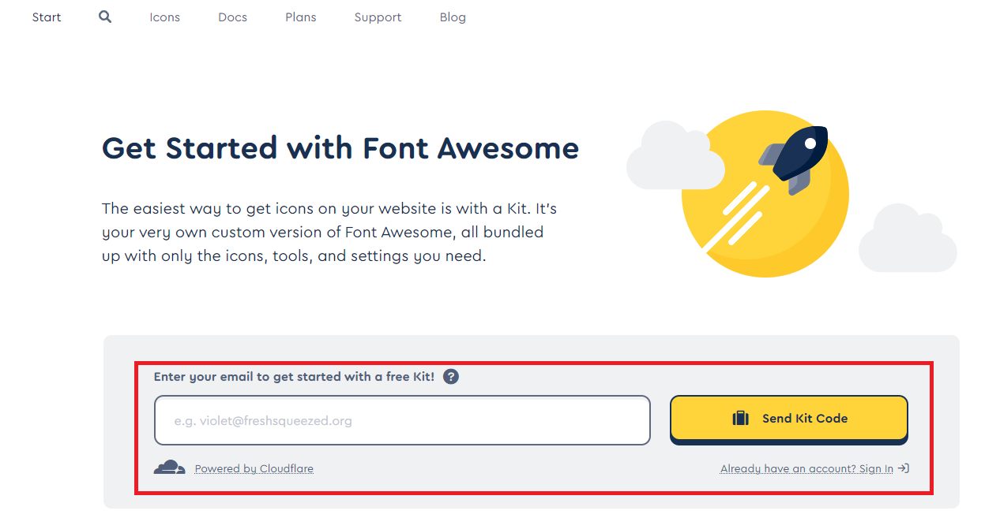
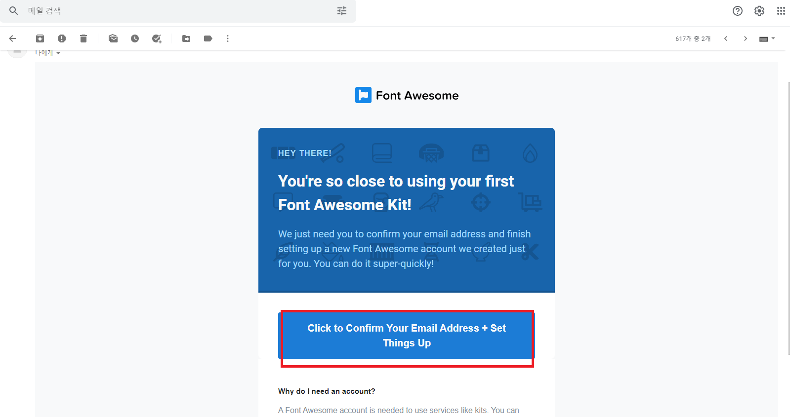
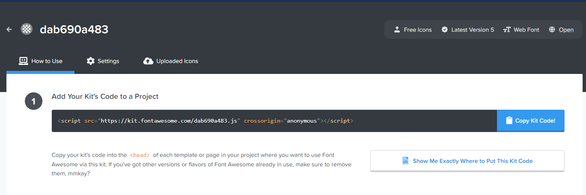

## 📌 사용기술

- HTML
- CSS

## 📌 강의내용 정리

### 🌍 구글 웹사이트 만들기

1) 웹사이트를 처음에 어떻게 분석하기

  * 웹 사이트에 구조를 보고 박스로 나누어 봐라(머리, 몸통, 다리)

    - 강사님은 3등분으로 나눕시다.

      - 머리, 몸통, 다리
  
      

  * HTML과 CSS파일이 잘 연결이 되는지 확인

    * `<head>`태그 안에 `<link>`태그가 있는지, `<link>`태그속 href에 css파일 주소가 잘 연결됬는지! 스펠체크!

  * 크롬의 개발도구를 활용하자

    - 웹사이트에서 마우스 오른쪽 클릭 
    - 맨마지막에 있는 inspect 또는 검사 클릭

2) 이세상 모든 아이콘이 있는 웹사이트!
   
   👉🏻[fontawsome](https://fontawesome.com/)

   **CDN 링크 신청방법**
   
   * 홈페이지에서 start 메뉴 누르기

    

   * 이메일 주소 입력하기 
  
    

   * 메일 인증하고 링크 받기 

    

    

### CDN (Content Delivery Network)이란?😏

CDN(콘텐츠 전송 네트워크)은 지리적으로 분산된 여러 개의 서버입니다. **웹 콘텐츠를 사용자와 가까운 곳에서 전송함**으로써 전송 속도를 높입니다. 전 세계 데이터센터는 파일 복사본을 임시로 저장하는 프로세스인 캐싱을 사용합니다. 따라서 사용자는 가까운 서버를 통해 웹 활성화 디바이스 또는 브라우저에서 인터넷 콘텐츠에 빠르게 접속할 수 있습니다. **CDN은 웹 페이지, 이미지, 비디오 등의 콘텐츠**를 사용자의 물리적 위치와 가까운 프록시 서버에 캐싱합니다. 이렇게 하면 콘텐츠가 로딩될 때까지 기다릴 필요 없이 영화 감상, 소프트웨어 다운로드, 은행 잔고 확인, 소셜 미디어 포스팅, 구매 등의 작업을 할 수 있습니다.

**CDN을 마치 ATM처럼 생각해도 좋습니다.** 여러 곳에 ATM을 설치해 놓으면 사용자가 빠르고 효율적으로 현금을 찾을 수 있습니다. 은행에서 긴 줄을 서서 기다릴 필요 없이 가까운 곳에 있는 ATM을 바로 사용하면 됩니다.

저희는 CDN을 통해서 fontawsome이 만들어준 스타일을 가져온겁니다!  

## 📌 데모 링크

